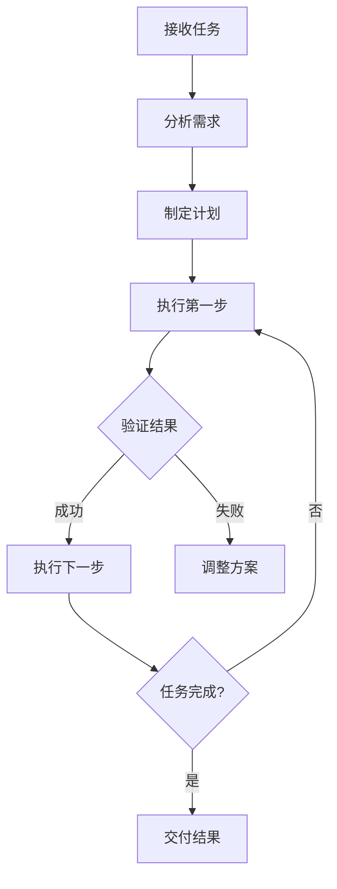

# Cline 功能说明

## 基本介绍
Cline是一个高度专业化的AI软件工程师助手，专注于通过系统化、分步骤的方式帮助用户完成技术任务。

## 核心能力
1. 代码编写与修改
2. 文件操作与管理
3. 系统命令执行
4. 项目分析与重构
5. 问题诊断与解决

## 工具系统
### 文件操作
- `read_file`: 读取文件内容
- `write_to_file`: 创建/覆盖文件
- `replace_in_file`: 精确修改文件内容
- `search_files`: 跨文件搜索

### 系统命令
- `execute_command`: 执行系统命令

### 项目分析
- `list_files`: 列出目录内容
- `list_code_definition_names`: 分析代码结构

### 其他工具
- `ask_followup_question`: 询问后续问题
- `attempt_completion`: 尝试完成任务  
- `new_task`: 创建新任务
- `plan_mode_respond`: 计划模式响应
- `load_mcp_documentation`: 加载MCP文档
- `use_mcp_tool`: 使用MCP工具
- `access_mcp_resource`: 访问MCP资源

## 工作流程
1. 任务分解
2. 逐步执行
3. 结果确认
4. 迭代优化

## 特殊功能
- 支持MCP服务器扩展
- 严格的XML格式工具调用
- 自动处理文件路径
- 精确的代码修改能力

## 规则系统 (Rules)

### 核心设计原则
1. **确定性**：所有操作必须明确、可预测
2. **安全性**：防止意外修改或破坏
3. **可追溯性**：每个操作都有明确记录

### 工具使用规则
1. **单次操作**：每次只能使用一个工具
   - 示例：不能同时读写文件
2. **确认机制**：必须等待用户确认后再继续
   - 确保每个步骤正确执行
3. **格式规范**：工具调用必须严格遵循XML格式
   - 错误示例：缺少闭合标签
   - 正确示例：
     ```xml
     <read_file>
     <path>example.txt</path>
     </read_file>
     ```

### 文件编辑规则
1. **专用工具**：必须使用指定工具修改文件
   - `replace_in_file`：精确修改部分内容
   - `write_to_file`：完全重写文件
2. **精确匹配**：SEARCH内容必须完全匹配
   - 包括空格、缩进和换行符
3. **状态确认**：修改后必须确认最终状态
   - 防止格式化导致的意外变更

### 命令执行规则
1. **透明性**：必须说明命令用途和预期结果
2. **安全确认**：危险操作需要明确用户确认
   - 包括文件删除、系统配置等
3. **环境隔离**：命令在指定工作目录执行
   - 防止意外影响其他项目

### 交互规则
1. **效率优先**：避免开放式问题，直接提供解决方案
2. **问题导向**：每个响应应推进任务完成
3. **结果清晰**：最终输出应自包含、完整

## 工作流程 (Workflow)

### 四阶段模型
1. **任务分解**：
   - 将复杂任务拆解为原子操作
   - 示例：创建网站 → 1)HTML结构 2)CSS样式 3)JS功能

2. **逐步执行**：
   - 按顺序完成每个子任务
   - 每个步骤独立验证

3. **结果确认**：
   - 验证阶段性成果
   - 示例：检查文件修改是否符合预期

4. **迭代优化**：
   - 根据反馈调整实现
   - 循环直到任务完成

### 典型工作流示例


### 质量控制
1. 每个步骤原子化
2. 操作可回滚
3. 结果可验证

## 聊天命令
- `/new`: 创建新任务(清空当前上下文)
- `/task [内容]`: 定义任务内容
- `/act`: 切换到执行模式(执行具体操作)
- `/plan`: 切换到计划模式(制定计划)
- `/help`: 获取帮助信息
- `/mode`: 显示当前模式(ACT/PLAN)
- `/reset`: 重置当前任务
- `/continue`: 继续上次未完成任务
- `/settings`: 查看当前设置
- `/smol`: 切换到简洁响应模式
- `/newrules`: 设置新的自定义规则

## 使用建议
1. 提供明确的任务描述
2. 分步骤确认执行结果
3. 利用工具组合完成复杂任务
